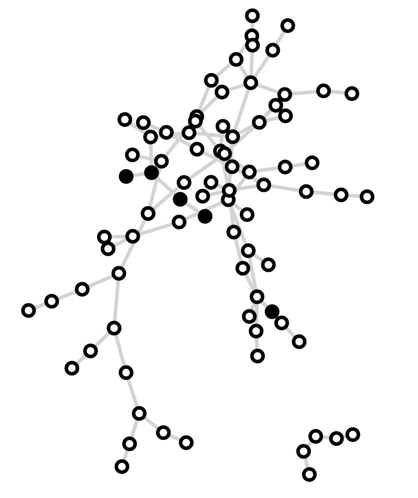

# Linear Threshold Model: Network Cascades and Boolean Functions Toolkit

This repository contains a Python module that provides a toolkit for working with network cascades, adjacency matrices, Boolean functions, and network visualization. It is designed to assist in various network-related tasks and analyses.

## Features

- Setup and execution of cascades on networks.
- Creation and manipulation of adjacency matrices.
- Generation and manipulation of truth tables for Boolean functions.
- Visualization of network structures.
- Support for different types of networks, including random geometric graphs.
- Utilizes external libraries like NumPy, SciPy, NetworkX, Matplotlib, Pandas, Seaborn, Networkit, and Pynauty.
- Includes both vectorized and non-vectorized implementations of cascade algorithms.
- Organized into sections for different types of functions.
- Some experimental or incomplete functions (exercise caution in production use).

## Sections

1. **Complexity Functions**
2. **Utility Functions**
3. **Network Visualization**
4. **Setup Functions**
5. **Cascade Functions**
6. **Cascade Analysis**
7. **Plotting Functions**
8. **Binary Array Operations**
9. **Truth Table Functions**
10. **Monte Carlo Trials**
11. **Boolean Function Analysis**
12. **Range of Monte Carlo Functions**
13. **Hamming Distance and Cube, and Boolean Logic Functions**
14. **Graph Measures**
15. **Data Generation**

## Usage

To use this toolkit, import the relevant functions and classes from the module into your Python code. You can then leverage the provided tools for your network-related tasks.

## Dependencies

This module relies on several external libraries, including NumPy, SciPy, NetworkX, Matplotlib, Pandas, Seaborn, Networkit, and Pynauty. Make sure to install these dependencies before using the toolkit.

## Research Papers

This toolkit is based on research presented in the following papers:

1. [Spontaneous emergence of computation in network cascades](https://www.nature.com/articles/s41598-022-40724-7)
   - Authors: Wilkerson, Galen; Moschoyiannis, Sotiris; Jensen, Henrik Jeldtoft
   - Published in Scientific Reports (2022)

2. [Logic and learning in network cascades](https://www.cambridge.org/engage/api-gateway/networksocietymedia/assets/orp/resource/item/6303f1350bb836c0bebb7a18/original/logic-and-learning-in-network-cascades.pdf)
   - Authors: Wilkerson, Galen J.; Moschoyiannis, Sotiris
   - Published in Network Science (2021)

**Note**: If you use this toolkit in your research, we kindly request that you cite the relevant research papers listed above to acknowledge the authors' contributions.

## Note

Please be aware that this module contains a mix of vectorized and non-vectorized cascade algorithms, along with some experimental or incomplete functions. Before using it in a production environment, review the code carefully and exercise caution.

## License

This toolkit is provided under the [MIT License](LICENSE).
