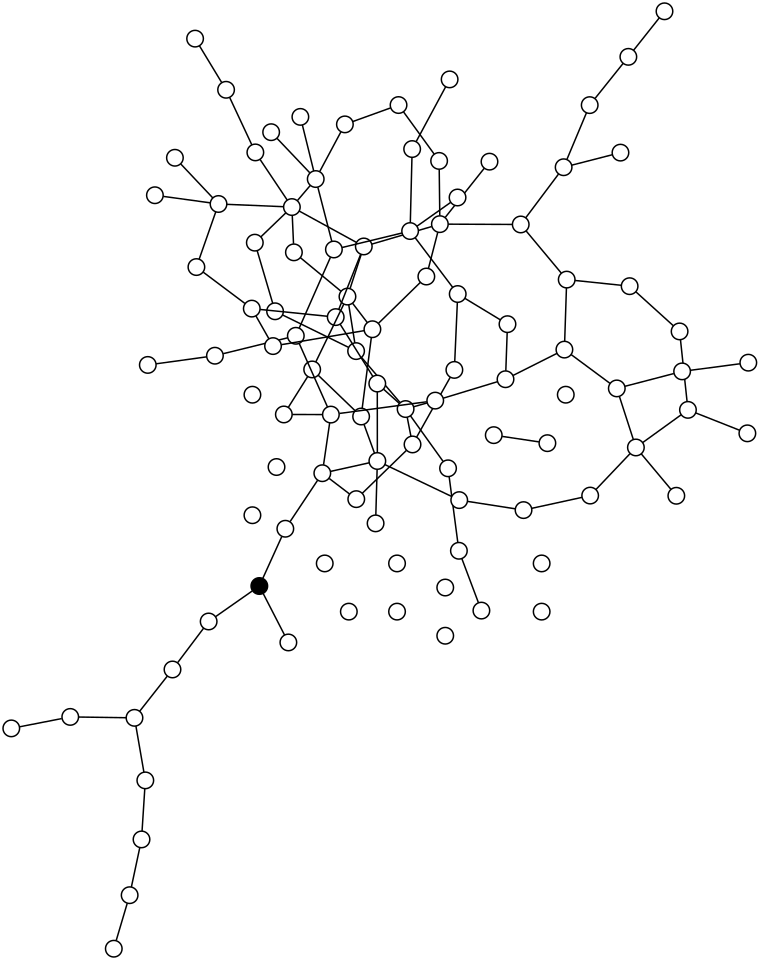

<!DOCTYPE html>
<html>
<body>
   

  

    <h1>Linear Threshold Model:</h1>
    <h2>Network Cascades and Boolean Functions Toolkit</h2>
  

 

This repository contains a Python module that provides a toolkit for working with network cascades, adjacency matrices, Boolean functions, and network visualization. It is designed to assist in various network-related tasks and analyses.

<h2>Features</h2>
<ul>
  <li>Setup and execution of cascades on networks.</li>
  <li>Creation and manipulation of adjacency matrices.</li>
  <li>Generation and manipulation of truth tables for Boolean functions.</li>
  <li>Visualization of network structures.</li>
  <li>Support for different types of networks, including random geometric graphs.</li>
  <li>Utilizes external libraries like NumPy, SciPy, NetworkX, Matplotlib, Pandas, Seaborn, Networkit, and Pynauty.</li>
  <li>Includes both vectorized and non-vectorized implementations of cascade algorithms.</li>
  <li>Organized into sections for different types of functions.</li>
  <li>Some experimental or incomplete functions (exercise caution in production use).</li>
</ul>

<h2>Sections</h2>
<ol>
  <li><strong>Complexity Functions</strong></li>
  <li><strong>Utility Functions</strong></li>
  <li><strong>Network Visualization</strong></li>
  <li><strong>Setup Functions</strong></li>
  <li><strong>Cascade Functions</strong></li>
  <li><strong>Cascade Analysis</strong></li>
  <li><strong>Plotting Functions</strong></li>
  <li><strong>Binary Array Operations</strong></li>
  <li><strong>Truth Table Functions</strong></li>
  <li><strong>Monte Carlo Trials</strong></li>
  <li><strong>Boolean Function Analysis</strong></li>
  <li><strong>Range of Monte Carlo Functions</strong></li>
  <li><strong>Hamming Distance and Cube, and Boolean Logic Functions</strong></li>
  <li><strong>Graph Measures</strong></li>
  <li><strong>Data Generation</strong></li>
</ol>

<h2>Usage</h2>

To use this toolkit, import the relevant functions and classes from the module into your Python code. You can then leverage the provided tools for your network-related tasks.

<h2>Dependencies</h2>

This module relies on several external libraries, including NumPy, SciPy, NetworkX, Matplotlib, Pandas, Seaborn, Networkit, and Pynauty. Make sure to install these dependencies before using the toolkit.

<h2>Research Papers</h2>

This toolkit is based on research presented in the following papers:

<ol>
  <li><a href="https://www.nature.com/articles/s41598-022-19218-0">Spontaneous emergence of computation in network cascades</a>
    <ul>
      <li>Authors: Wilkerson, Galen; Moschoyiannis, Sotiris; Jensen, Henrik Jeldtoft</li>
      <li>Published in Scientific Reports (2022)</li>
    </ul>
  </li>
  <li><a href="https://www.cambridge.org/core/journals/network-science/article/logic-and-learning-in-network-cascades/B89A3EB13FF6F1719482D38F11E37068">Logic and learning in network cascades</a>
    <ul>
      <li>Authors: Wilkerson, Galen J.; Moschoyiannis, Sotiris</li>
      <li>Published in Network Science (2021)</li>
    </ul>
  </li>
</ol>

<strong>Note</strong>: If you use this toolkit in your research, we kindly request that you cite the relevant research papers listed above to acknowledge the authors' contributions.

<h2>Note</h2>

Please be aware that this module contains a mix of vectorized and non-vectorized cascade algorithms, along with some experimental or incomplete functions. Before using it in a production environment, review the code carefully and exercise caution.

<h2>License</h2>

This toolkit is provided under the <a href="LICENSE">MIT License</a>.

 

        <h1>Linear Threshold Model Zoo</h1>
    

    

        <!-- Add your images here -->
        
        
        
        
        
        
        
        
        
        
        
        
        
    

</body>
</html>

